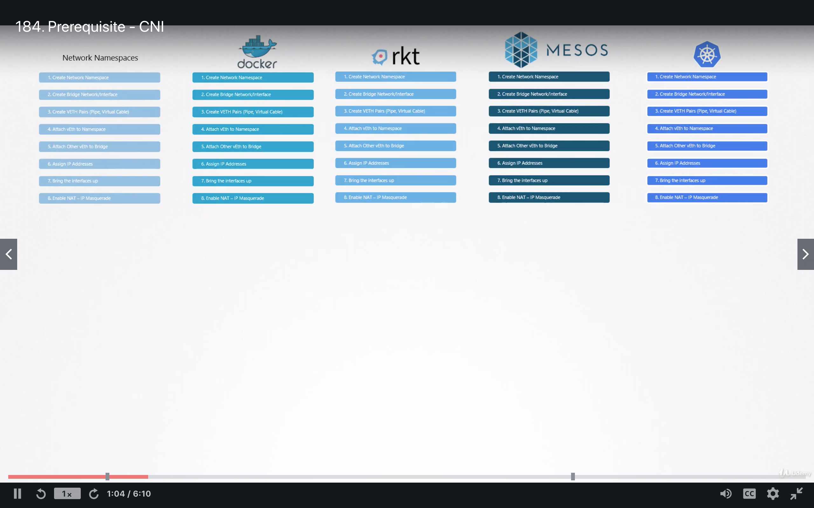
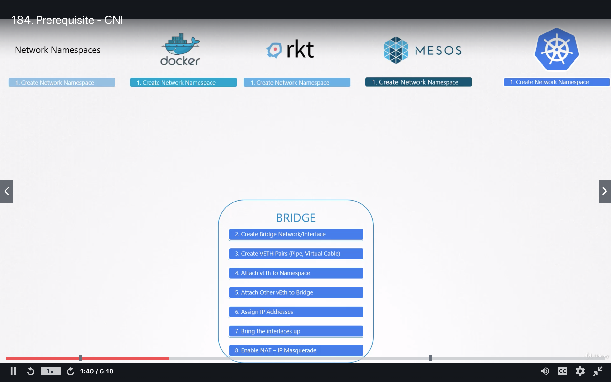
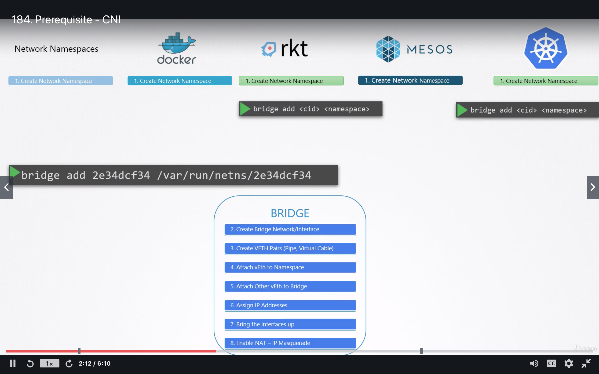
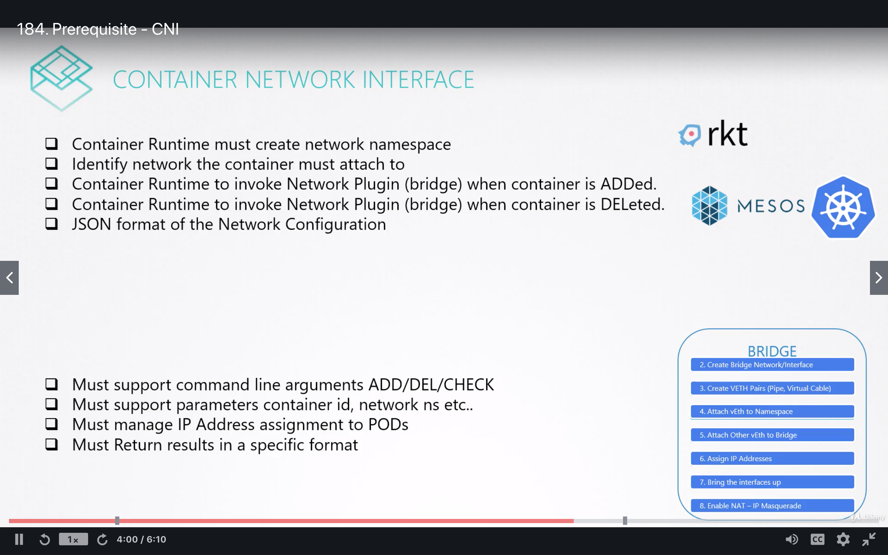
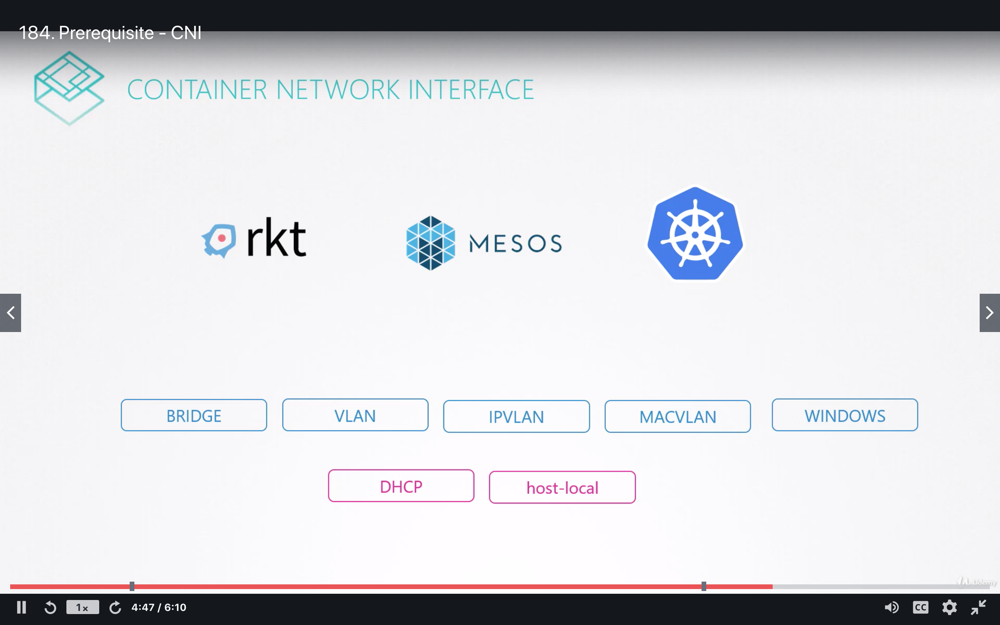
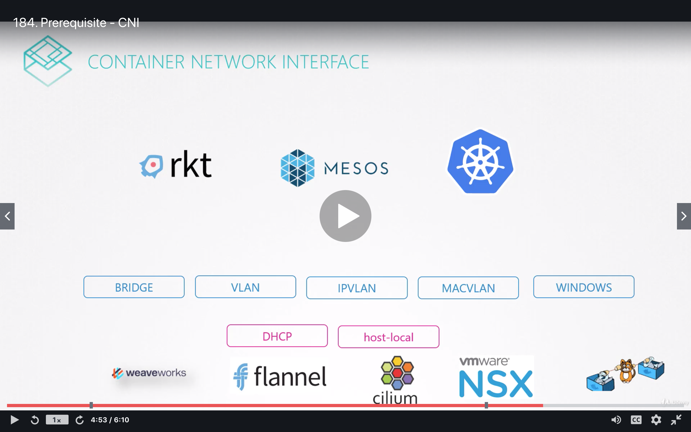
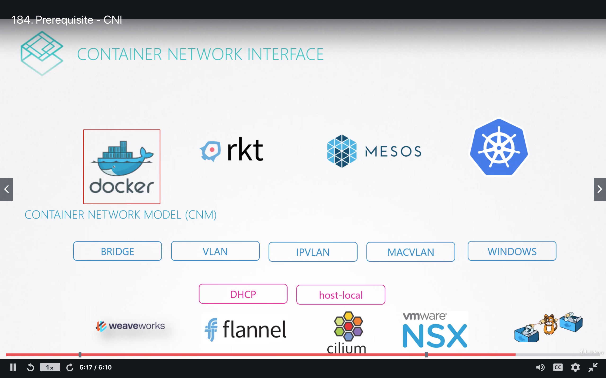
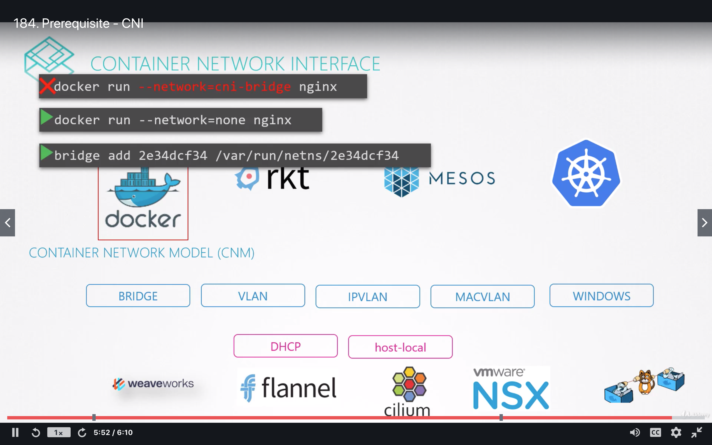
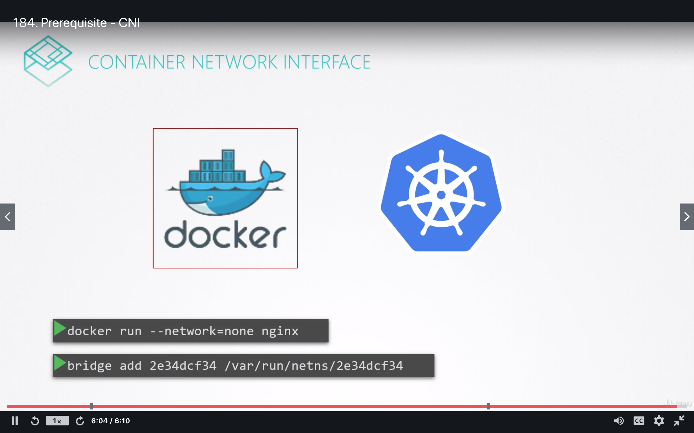

# Network namespace requirement 
All container follow same approach to assign network

# Move common network requirement into single program
- Move common network into single program

- Container call this common program 

# Container network interface
- Set of standards define how program to develop to solve network challenges in container runtime

- Plugins

- Some plugins are developed by third parties

- Docker doesn't implement CNI
    - It has it's own standard called CNM
    
    - CNI creates `none` network then manually invoke cni plugin yourself
    
    - This is how Kubernetes create Docker container
    

